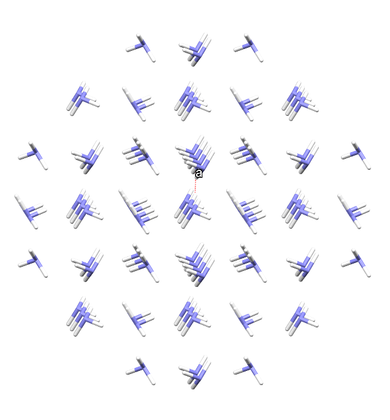
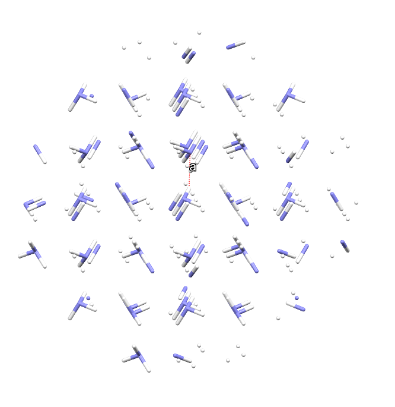
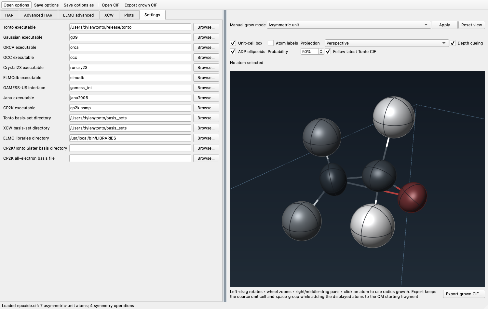
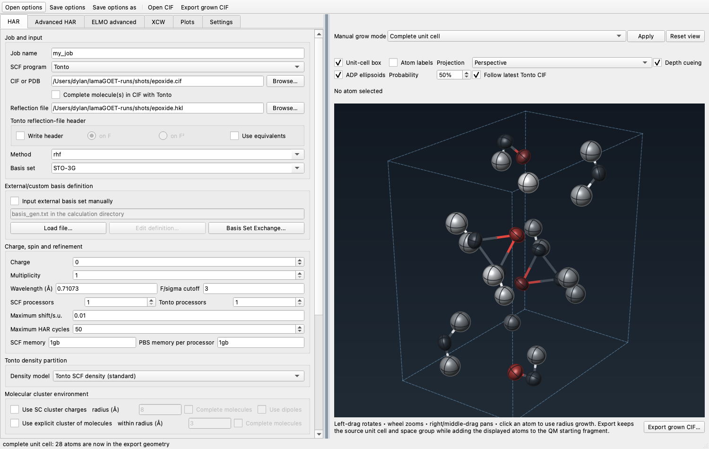

# lamaGOET workshop

A guided introduction to Hirshfeld Atom Refinement with lamaGOET, adapted from
Lorraine Andrade Malaspina's 2024 lab notes. Two worked examples, with published
numbers to check your results against.

The original notes covered two further examples that are not reproduced here:
one needs ELMOdb, which is obtained by contacting its author, and one needs a
dataset that was never distributed.

---

## Why bother

Ordinary refinement, as in SHELXL, minimises

$$M = \sum w\,(|F_o| - |F_c|)^2$$

where $F_o$ and $F_c$ are the observed and calculated structure factors. The
calculated ones come from a sum over atomic form factors $f_j$:

$$F(\vec{h}) = \sum_{j=1}^{N} f_j \, e^{2\pi i \vec{h} \cdot \vec{r}}$$

Those $f_j$ describe how an **isolated atom type** scatters, and they are read
from a table — Tables 4.2.6.8 and 6.1.1.4 of *International Tables* Vol. C.

Read that again, because everything follows from it: every atom is modelled as
an isolated, non-interacting sphere sitting at the centre of its electron
cloud, regardless of what it is bonded to or what its oxidation state is.

For hydrogen that is badly wrong. A hydrogen atom's electron density peaks
*inside* the bond, not at the nucleus — so a spherical model places the atom
too close to its neighbour. This is the well-known shortening of X–H distances
in X-ray structures.

**Hirshfeld Atom Refinement** computes the form factors instead of looking them
up — for each atom, not each atom *type* — from a quantum chemical calculation
on the actual molecule. The resulting atomic densities are aspherical and
distorted by their surroundings, as real ones are, and the hydrogens land close
to where neutron diffraction puts them.

## How it works

Starting from an ordinary refined structure — HAR is a *post-IAM* procedure:

1. **A single-point calculation** gives the molecular electron density.

2. **That density is partitioned** into atoms by Hirshfeld's stockholder
   scheme, each atom taking a share proportional to what a free atom would
   contribute there:

   $$\rho_A(\vec{r}) = w_A(\vec{r}) \cdot \rho_{\text{molecule}}(\vec{r})
   \qquad
   w_A(\vec{r}) = \frac{\rho_A^0(\vec{r} - \vec{r}_A)}{\sum_B \rho_B^0(\vec{r} - \vec{r}_B)}$$

   Each atomic density is then smeared by thermal motion and Fourier
   transformed into a scattering factor.

3. **A least-squares refinement** against the measured reflections, using those
   tailor-made scattering factors.

The geometry has now changed, so the density is out of date — go back to step 1.
Repeat until nothing moves.

### The crystal environment

The wavefunction is computed for an isolated molecule, so the crystal is
missing. lamaGOET can simulate it by surrounding the molecule with point
charges, taken from the Hirshfeld atoms themselves and iterated to
self-consistency.

Those charges are placed on every atom within a chosen radius — but a sphere
cuts through molecules at its edge, leaving charged fragments that converge
slowly and badly. Completing them fixes that:

| completed | not completed |
|---|---|
|  |  |

Molecules at the edge of the sphere are whole on the left and cut on the right.
Use complete molecules unless you are working on a network compound, where
completion never terminates.

Including a cluster of charges matters more than using a large basis set, and
gets hydrogen positions comparable to neutron results. HF/def2-SVP with no
cluster charges is the "minimal HAR", and a reasonable starting point.

## Three things to know before you start

1. **Reflection files must be merged and pruned of systematic absences.**

2. **The molecule must be chemically complete.** HAR runs a quantum chemical
   calculation on whatever fragment you give it. If the asymmetric unit holds
   a third of a molecule, you must complete it first, or the calculation is
   meaningless.

3. **Tonto eliminates linear dependencies in the least-squares matrix
   automatically**, so it has no restraints or constraints. That can cause
   trouble for spherical ions. lamaGOET exists partly to work around this by
   letting a different program supply the wavefunction.

---

## Before you begin

Install lamaGOET and Tonto by following [INSTALL.md](INSTALL.md). You need
Tonto for both examples below; no other quantum-chemistry program is required.

Check it works:

```bash
cd examples/1-epoxide
bash /path/to/lamaGOET/lamaGOET_qt.sh
```

The interface opens on the **HAR** tab. lamaGOET finds Tonto and its basis sets
by itself, so the **Settings** tab is normally already correct — have a look
and correct it if not.



---

## Example 1 — epoxide

One whole molecule in the asymmetric unit, so nothing needs completing. About
ten seconds.

Working in `examples/1-epoxide`, fill in the **HAR** tab:


| Field | Value |
|---|---|
| Job name | `my_job` |
| SCF program | Tonto |
| CIF or PDB | `epoxide.cif` |
| Reflection file | `epoxide.hkl` |
| Method | `rhf` |
| Basis set | `STO-3G` |
| Wavelength | `0.71073` (Mo Kα) |
| F/sigma cutoff | `4` |
| Use SC cluster charges | unticked |

Tick **Start refinement with a Tonto IAM** on the *Advanced HAR* tab. That runs
an independent-atom refinement first, so you have a like-for-like baseline:
Tonto weights and cuts reflections differently from SHELXL, so comparing
against a SHELXL IAM is not quite fair.

Press **OK**. Results collect in `my_job.lst`.

### What you should get

Search `my_job.lst` for `IAM refinement` and `Structure refinement results` —
the first is the starting model, the second the HAR.

| Epoxide          | SHELX IAM  | Tonto IAM  | HAR   | HAR + charges |
|:-----------------|:----------:|:----------:|:-----:|:-------------:|
| R(F)             |   0.0353   |   0.0355   |   ?   |       ?       |
| wR(F²)           |   0.0964   |   0.0725   |   ?   |       ?       |
| ρ<sub>max</sub>  |   0.205    |   0.220    |   ?   |       ?       |
| ρ<sub>min</sub>  |  −0.213    |  −0.225    |   ?   |       ?       |
| reflections      |   1308     |   1308     |   ?   |       ?       |
| parameters       |   44       |   44       |   ?   |       ?       |
| C–H distances    | 0.997(10)  | 1.003(9)   |   ?   |       ?       |
|                  | 0.993(10)  | 0.974(8)   |   ?   |       ?       |
|                  | 0.945(11)  | 0.971(10)  |   ?   |       ?       |
|                  | 0.947(11)  | 0.958(9)   |   ?   |       ?       |

Every **?** is for you to fill in from your own run. **Watch the C–H
distances** — that is where HAR earns its keep.

Tonto also writes a residual-density grid over the unit cell, which
[VESTA](https://jp-minerals.org/vesta/en/download.html) will open.

### Now add the crystal environment

Make a new directory, copy `job_options.txt` into it — that saves re-entering
everything — and run lamaGOET there again. Tick **Use SC cluster charges**,
radius 8 Å, with **Complete molecules**. About fifty seconds.

Fill in the last column. How much did the hydrogens move?

### Things to try

- Re-run with an F/σ cutoff of 3 instead of 4, including weaker reflections.
  What happens to the residual density?
- Change the basis set. STO-3G is minimal; def2-SVP is a fairer test.
- Instead of point charges, use **Use explicit cluster of molecules** — real
  neighbouring molecules rather than charges. Much slower: hours, not seconds,
  because the calculation now includes every one of them.

---

## Example 2 — NH₃ or urea

The point of this one is what happens when the asymmetric unit does **not**
contain a whole molecule. Ammonia has a third of one; urea has a quarter.

Since HAR needs a chemically complete fragment, you must tick **Complete
molecule(s) in the CIF with Tonto**. Tonto then follows the covalent
connectivity outward and rebuilds whole molecules.

Working in `examples/2-NH3` or `examples/3-Urea`, set up as for epoxide, but:

- tick **Complete molecule(s) in the CIF with Tonto**
- **for urea the wavelength is 0.3173 Å**, not 0.71073

Run it twice, in separate directories: once plain, once with cluster charges to
8 Å.

| Urea             | SHELX IAM  | Tonto IAM  | HAR   | HAR + charges |
|:-----------------|:----------:|:----------:|:-----:|:-------------:|
| R(F)             |   0.0253   |     ?      |   ?   |       ?       |
| wR(F²)           |   0.0680   |     ?      |   ?   |       ?       |
| ρ<sub>max</sub>  |   0.352    |     ?      |   ?   |       ?       |
| ρ<sub>min</sub>  |  −0.214    |     ?      |   ?   |       ?       |
| reflections      |   817      |     ?      |   ?   |       ?       |
| parameters       |   21       |     ?      |   ?   |       ?       |
| N–H distances    | 0.964(17)  |     ?      |   ?   |       ?       |
|                  | 0.900(12)  |     ?      |   ?   |       ?       |

| NH₃              | SHELX IAM  | Tonto IAM  | HAR   | HAR + charges |
|:-----------------|:----------:|:----------:|:-----:|:-------------:|
| R(F)             |   0.0071   |     ?      |   ?   |       ?       |
| wR(F²)           |   0.0191   |     ?      |   ?   |       ?       |
| ρ<sub>max</sub>  |   0.014    |     ?      |   ?   |       ?       |
| ρ<sub>min</sub>  |  −0.013    |     ?      |   ?   |       ?       |
| reflections      |   98       |     ?      |   ?   |       ?       |
| parameters       |   8        |     ?      |   ?   |       ?       |
| N–H distance     | 0.842(7)   |     ?      |   ?   |       ?       |

Compare the two structures. The crystal environment matters far more for urea
than for epoxide — worth working out why before reading on. (Urea is held
together by strong, directional hydrogen bonds; epoxide is not.)

### Seeing the completion

You can watch this happen. Open the CIF, choose **Complete
fragment(s)/molecule(s)** beside the structure view and press **Apply**: two
atoms become four for ammonia. Choose **Complete unit cell** and you get the
packing:



This is a **separate mechanism** from the checkbox. The view and the *Export
grown CIF* button use lamaGOET's own copy of the algorithm; the checkbox asks
Tonto to do it during the run. Only the checkbox affects the refinement.

And note: *Export grown CIF* writes whatever is displayed. If you have not
pressed **Apply**, you get your original structure back unchanged. lamaGOET
warns you if you try.

---

## Where things end up

Everything is written into the directory you started lamaGOET from:

| | |
|---|---|
| `<my_job>.lst` | the results — always look here first |
| `stdout` | Tonto's full output, if `.lst` is not enough |
| `stdin` | the Tonto input lamaGOET generated |
| `<my_job>.archive.cif` | the refined structure |
| `<my_job>.residual_density,cell.cube` | for VESTA |
| `<N>.tonto_cycle.<my_job>/` | folder with a snapshot of each cycle |

`<my_job>` is whatever you put in the **Job name** box; `my_job` is the
default.

The `stdout` and `stdin` in the working directory are **from the last Tonto
run only**, because each run overwrites them. That last run is the final
residual-density calculation, not the last refinement cycle. Every cycle's own
copy is kept, numbered, inside its `<N>.tonto_cycle.<my_job>/` folder — so look
there, not at the top level, when you want to see what happened during a
particular cycle.

With Tonto as the SCF program you get one cycle directory, `N=1`, because Tonto
runs the whole refinement loop internally. With Gaussian or ORCA you may get
more than one cycle, since Tonto produces a surrounding cluster of charges
simulating the crystal environment in each new iteration.

---

## References

1. S. C. Capelli, H.-B. Bürgi, B. Dittrich, S. Grabowsky, D. Jayatilaka,
   *Hirshfeld atom refinement*. **IUCrJ** 2014, *1*, 361–379.
2. D. Jayatilaka, B. Dittrich, *X-ray structure refinement using aspherical
   atomic density functions obtained from quantum-mechanical calculations*.
   **Acta Cryst. A** 2008, *64*, 383–393.
3. F. L. Hirshfeld, *Can X-ray data distinguish bonding effects from
   vibrational smearing?* **Acta Cryst. A** 1976, *32*, 239–244.
4. F. L. Hirshfeld, *Bonded-atom fragments for describing molecular
   charge densities*. **Theor. Chim. Acta** 1977, *44*, 129–138.
5. M. Fugel *et al.*, *Probing the accuracy and precision of Hirshfeld atom
   refinement with HARt interfaced with Olex2*. **IUCrJ** 2018, *5*, 32–44.
6. M. Woinska, S. Grabowsky, P. M. Dominiak, K. Wozniak, D. Jayatilaka,
   *Hydrogen atoms can be located accurately and precisely by x-ray
   crystallography*. **Sci. Adv.** 2016, *2*, e1600192.
